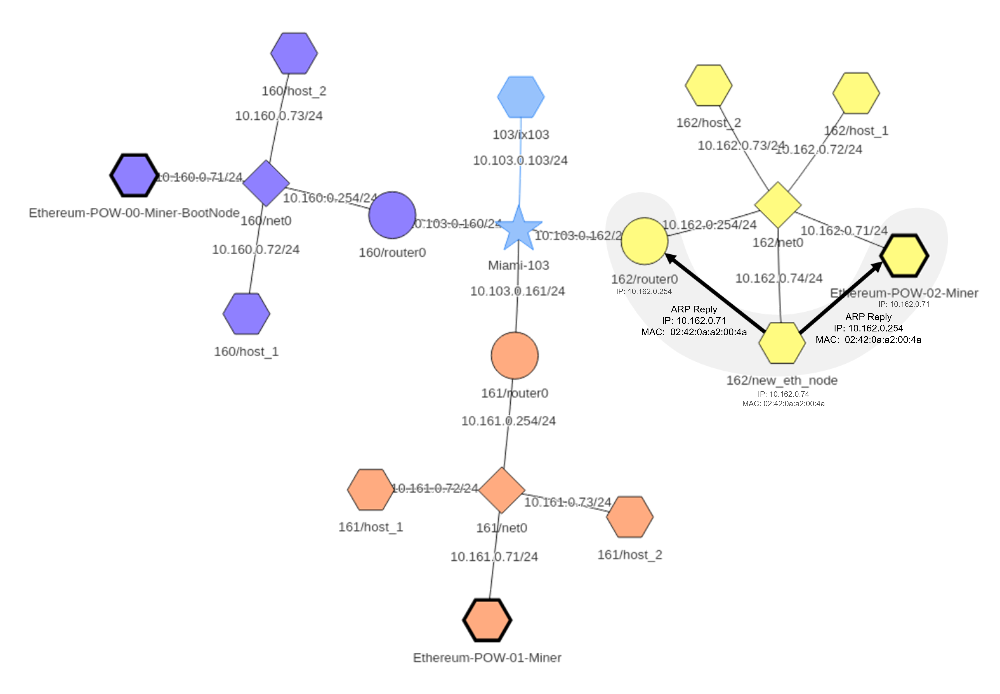
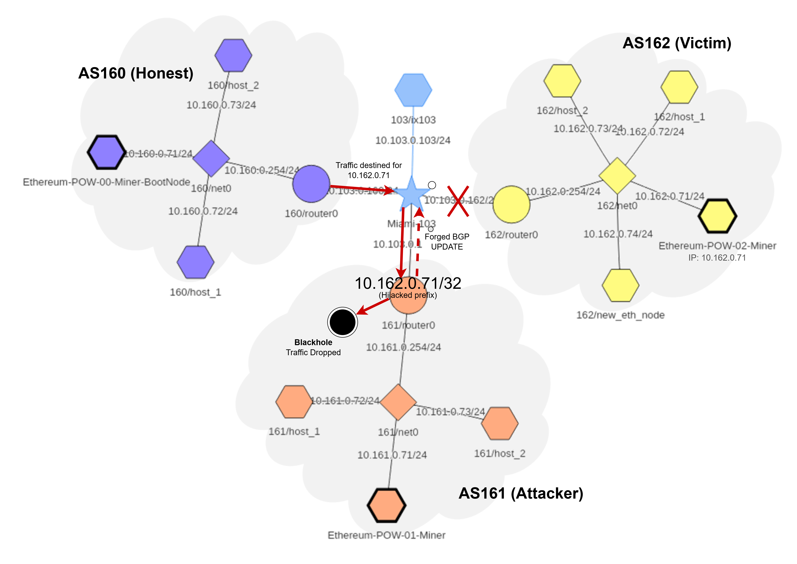
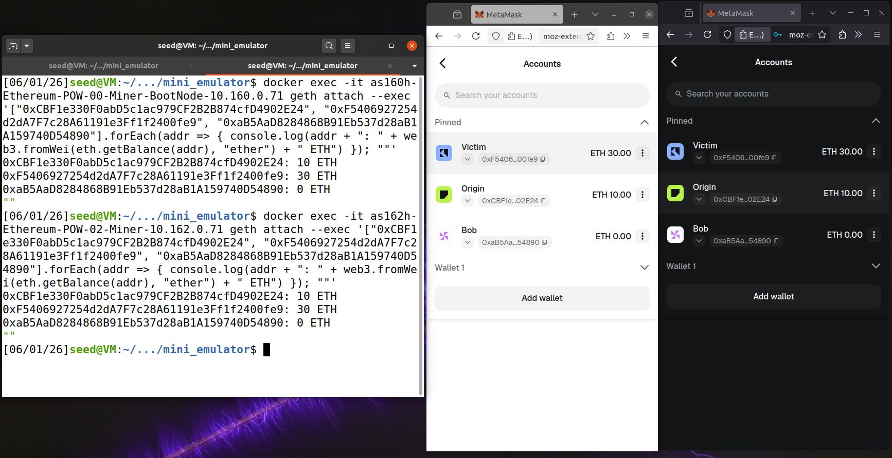
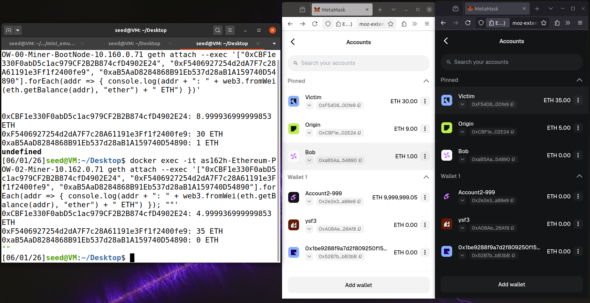
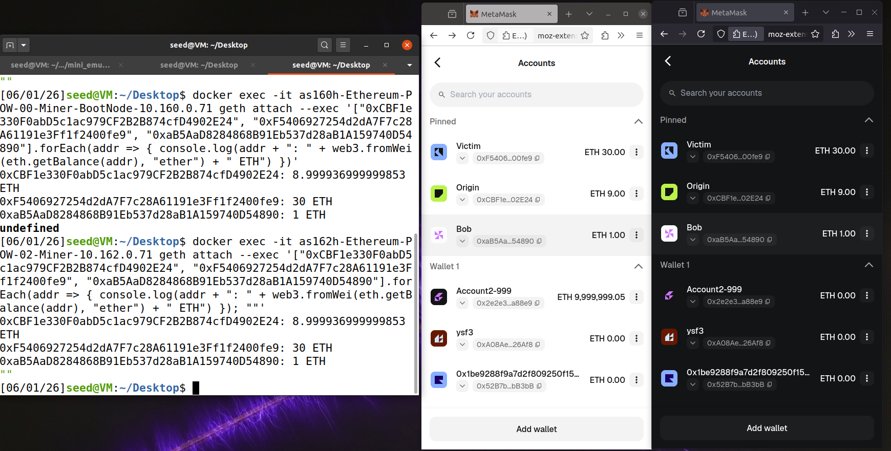
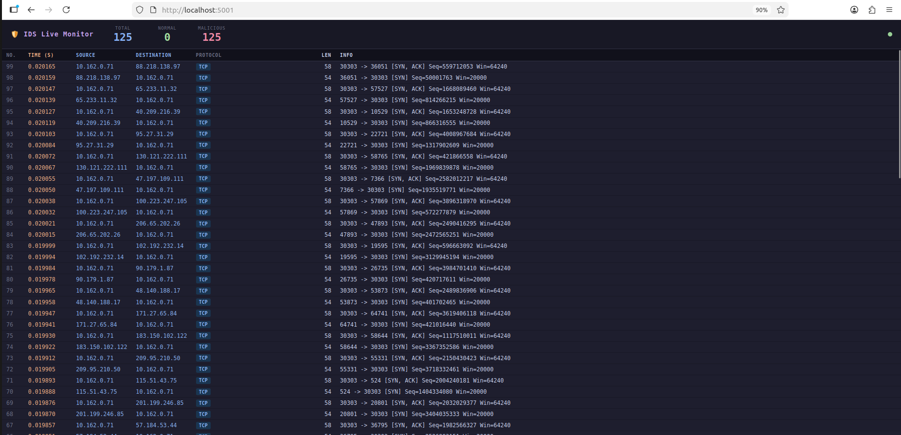

# Machine-Learning-Based Traffic Analysis for Intrusion Detection in Peer-to-Peer Networks

Gabriela Silva, Pedro Oliveira, Sagun Paudel, Vítor Pires

> [!WARNING]
> This project is for educational use in a controlled, emulated environment as part of the [Network Security (SR)](https://sigarra.up.pt/feup/pt/ucurr_geral.ficha_uc_view?pv_ocorrencia_id=560285) course at FEUP. Do not run these attacks against networks you do not own or are not authorized to test.

This project studies attacks against a private Ethereum Proof-of-Work network and builds a machine-learning Intrusion Detection System (IDS) to detect them.

It has two parts:

1. **Attacks**: isolate a victim miner and perform a Double Spend, plus a SYN flood denial-of-service attack.
2. **IDS**: capture network traffic, extract features, and train models to classify or flag malicious packets, including a real-time live dashboard.

The network is emulated with the [Seed Internet Emulator](https://github.com/seed-labs/seed-emulator) framework and runs as a set of Docker containers.

## Repository Layout

```
feup-sr-proj/
├── attacks/                        # Attacks (victim: AS 162)
│   ├── README.md                   # Full attack walkthrough
│   ├── attacks.py                  # Attack orchestration
│   ├── fake_tx.py / real_tx.py     # Double-spend transactions
│   ├── l2_arp_spoofing/            # ARP Spoofing attack
│   ├── l3_bgp_hijacking/           # BGP Hijkacking attack
│   └── synflood/                   # SYN flood denial-of-service
├── attacks_as160/                  # Same attacks (victim: AS 160)
├── emulator_code/
│   │   ├── base-component.py       # Defines Autonomous Systems & BGP routing plane
│   │   ├── blockchain-poa.py       # Compiles Proof-of-Authority environment 
│   │   └── blockchain-pow.py       # Compiles Proof-of-Work environment
└── mini_emulator/                  # SEED emulator + IDS
    ├── docker-compose.yml          # Emulated AS network (Docker)
    ├── Makefile                    # Lifecycle, attack toggles, capture
    ├── capture_full.sh             # Capture pcaps on all bridges
    ├── eth_startup.py              # Node bootstrap
    ├── traffic_gen.py              # Background traffic generator
    └── ids/                        # Machine-learning IDS
        ├── feature_extraction.py   # PCAP -> per-packet features
        ├── classify.py             # Supervised classifiers
        ├── detect_outliers.py      # Unsupervised anomaly detection
        ├── feature_importance.py   # Feature ranking
        ├── *_from_csv.py           # Same steps starting from a CSV
        ├── real_time/
        │   └── main.py             # Live detection + browser dashboard
        └── utils/                  # Analysis, evaluation, visualization
```


## Network Architecture

Three interconnected Autonomous Systems (AS), each running an Ethereum PoW miner:

- **AS 160** — `10.160.0.71` BootNode Miner
- **AS 161** — `10.161.0.71` Miner
- **AS 162** — `10.162.0.71` Miner

Depending on the scenario, one node is chosen as the victim and one node or a border router acts as the attacker.

## The Attacks

The full attack walkthrough lives in [`attacks/README.md`](attacks/README.md) (and [`attacks_as160/README.md`](attacks_as160/README.md) for the AS 160 scenario). The exploit runs in three phases:

1. **Isolation**: partition the victim from the network, using either
   [ARP spoofing](attacks/l2_arp_spoofing/README_ARP.md) or
   [BGP hijacking](attacks/l3_bgp_hijacking/README_BGP.md).


<div align="center">
    
    
    <p><b>Figure 1:</b> ARP Spoofing & BGP Hijacking. </p>
</div>

2. **Double Spend**: send two conflicting transactions reusing the same nonce: a fake one to the isolated victim and a real one to the main network.

<div align="center">
    
    
    
    <p><b>Figure 2:</b> Double-spending attack: balance states observed across the three phases of the exploit.</p>
</div>

3. **Chain Reorganization**: reconnect the network so the longest chain wins and the isolated transaction is discarded.

A SYN flood attack is also available under `attacks/synflood/`.

## The Emulator

The emulator and its tooling are driven by a Makefile. From `attacks/`:

```bash
make up               # build and start all containers
make attack           # launch attack script with currently activated attacks
make capture          # capture pcaps on all bridges
make down             # stop and remove containers
make restart          # make up + make down
```

Attacks can be toggled on and off through Makefile variables.

## The IDS

The IDS turns captured traffic into labelled features and trains models to
detect attacks. Scripts live in `mini_emulator/ids/`:

- `feature_extraction.py`: extract per-packet features from a PCAP.
- `classify.py`: train and evaluate supervised classifiers (Random Forest,
  Logistic Regression, SVM, Decision Tree, kNN).
- `detect_outliers.py`: train unsupervised anomaly detectors (Isolation
  Forest, One-Class SVM, LOF, Elliptic Envelope) on normal traffic only.
- `*_from_csv.py`: the same steps starting from an exported CSV.
- `real_time/main.py`: real-time detection with a live browser dashboard.

Example usage:

```bash
# Train a classifier directly from a capture --- to be launched from mini_emulator/
python -m ids.classify.py capture.pcap 

# Train an anomaly detector --- to be launched from mini_emulator/
python -m ids.detect_outliers capture.pcap

# Real-time detection with a dashboard at http://<node-ip>:5001/ --- to be called from inside the container Miner160
sudo python3.9 /opt/ids-app/ids/real_time/main.py <interface> <model.joblib> <scaler.joblib>
```

<div align="center">
    
    <p><b>Figure 3:</b> IDS program during a SYN Flood attack. </p>
</div>

## Datasets

The datasets used to obtain the final results can be found  [here](https://drive.google.com/file/d/1XQRVMsgQlKQMW1TC0U6yaVz-Qjlnwbxu/view?usp=drive_link).

